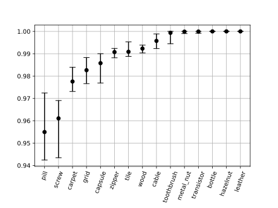

# PatchCore

This repository contains a simple implementation of the PatchCore anomaly detection algorithm, based on the paper *"PatchCore: Efficient Patch-based Outlier Detection"* by R. Schneider et al. (2022). The implementation is designed to be straightforward and easy to use, with a focus on clarity and simplicity.

The PatchCore classifier is implemented as a custom Torch module, enabling seamless integration into PyTorch-based workflows and facilitating export to production environments via ONNX or similar frameworks.

For usage examples, please refer to `example.py`. This script demonstrates typical usage patterns and can serve as a starting point for your own applications.

I plan to eventually publish this package on PyPI for easier accessibility. As the `scikit-learn` and `scikit-image` libraries are currently only used for benchmarking and segmentation generation, I plan to remove them and implement custom methods for computing the AUROC score and detecting contours.

---

# AUROC Score Benchmark Results on the MVTecAD Dataset

I ran a few test runs with the following settings:
- Nearest neighbors set to 1 (equivalent to no reweighting)
- Patch size set to 3
- Subsampling at 1%
- Feature dimensions as proposed in the [original repository](https://github.com/amazon-science/patchcore-inspection)

As expected, scores fluctuate slightly due to the random first element in subsampling. However, the results are consistent with those reported in the paper.

| Key | Mean Value | Max Value | Min Value |
|-----|------------|-----------|-----------|
| cable | 99.6% | 99.9% | 99.2% |
| bottle | 100.0% | 100.0% | 100.0% |
| hazelnut | 100.0% | 100.0% | 100.0% |
| wood | 99.2% | 99.4% | 99.0% |
| metal_nut | 100.0% | 100.0% | 99.9% |
| screw | 96.1% | 96.9% | 94.3% |
| pill | 95.5% | 97.2% | 94.2% |
| transistor | 100.0% | 100.0% | 99.9% |
| tile | 99.1% | 99.5% | 98.9% |
| grid | 98.3% | 98.8% | 97.7% |
| zipper | 99.1% | 99.2% | 98.8% |
| carpet | 97.8% | 98.4% | 97.3% |
| toothbrush | 99.9% | 100.0% | 99.4% |
| leather | 100.0% | 100.0% | 100.0% |
| capsule | 98.6% | 99.0% | 97.7% |

---

# Final Comments

I implemented an aggregation function based on average pooling, which I personally find aligns more closely with the description in the paper compared to the original repository’s approach. Additionally, it's more transparent, as the workings of adaptive average pooling aren't immediately clear. Note that when using the `AverageAggregator`, the optimal patch size may differ from the values suggested in the paper.
